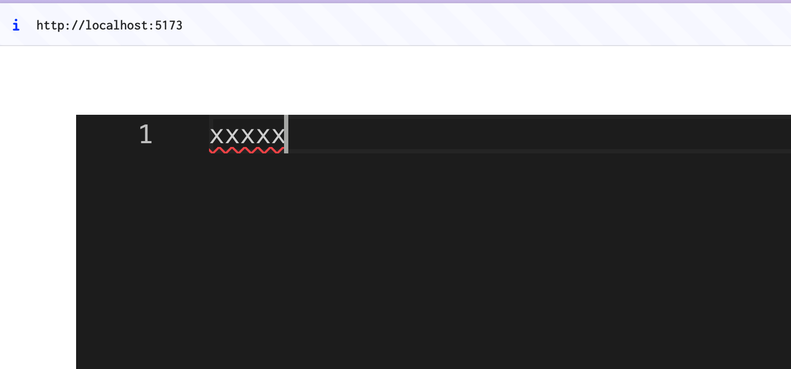

clienでえいや
すごい



# run

```bash
cd frontend && npm run dev
cd backend && go run ./main.go
```


# command history
```bash
npm create vite@latest frontend -- --template react-ts
cd frontend && npm install @monaco-editor/react
mkdir backend && cd backend && go mod init co-writer-v2/backend
cd backend && go get github.com/gorilla/websocket
cd frontend && npm install && npm run dev
cd backend && go run main.go
```
